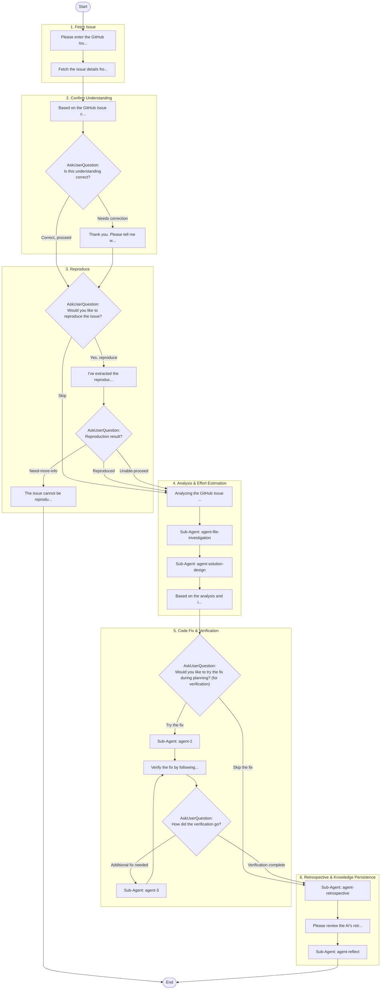

## Workflow Execution Guide

Follow the Mermaid flowchart above to execute the workflow. Each node type has specific execution methods as described below.

### Execution Methods by Node Type

- **Rectangle nodes (Sub-Agent: ...)**: Execute Sub-Agents
- **Diamond nodes (AskUserQuestion:...)**: Use the AskUserQuestion tool to prompt the user and branch based on their response
- **Diamond nodes (Branch/Switch:...)**: Automatically branch based on the results of previous processing (see details section)
- **Rectangle nodes (Prompt nodes)**: Execute the prompts described in the details section below

### Group Node Execution Tracking

This workflow contains group nodes. Before executing nodes within each group, call the `highlight_group_node` MCP tool on the `cc-workflow-studio` server to visually highlight the active group on the canvas.

| Group ID | Label |
|----------|-------|
| group-1 | 1. Fetch Issue |
| group-2 | 2. Confirm Understanding |
| group-3 | 3. Reproduce |
| group-5 | 4. Analysis & Effort Estimation |
| group-6-merged | 5. Code Fix & Verification |
| group-7 | 6. Retrospective & Knowledge Persistence |

Call example: `highlight_group_node({ groupNodeId: "<group-id>" })`

When the workflow completes, call `highlight_group_node({ groupNodeId: "" })` to clear the highlight.

## Sub-Agent Node Details

#### agent-file-investigation(Sub-Agent: agent-file-investigation)

**subagent_type**: explore

**Description**: Investigate codebase

**Prompt**:

```
Investigate files related to the issue.

## Tasks
1. Extract keywords from the issue description
2. Use Read/Grep/Glob tools to identify related files
3. Review code at problem areas
4. Analyze scope of impact and dependencies

## Required Output Format

**Related Files**
- `path/to/file.ts` (lines X-Y) — one-line role description

**Problem Areas**
- File: `path/to/file.ts`
  Line: N
  Code snippet:
  ```
  (3-5 relevant lines)
  ```
  Issue: (1-2 sentence explanation of what's wrong)

**Impact Analysis**
- Dependencies: files that depend on the problem areas
- Usage sites: where the problem code is called from

Do not omit any section. If a section has no findings, explicitly write "None".
```

**Parallel Execution**: enabled

When executing this node, assess whether the task involves multiple independent areas or concerns.
If so, launch multiple agents of the same subagent_type in parallel — one per independent area.

Guidelines:
- Single area of concern → execute with 1 agent
- Multiple independent areas → spawn 1 agent per area, execute in parallel
- Wait for all agents to complete before proceeding to the next node
- Consolidate all agent results before passing to the next node

#### agent-solution-design(Sub-Agent: agent-solution-design)

**subagent_type**: plan

**Description**: Design fix strategy

**Prompt**:

```
Based on the investigation, design a fix strategy.

## Tasks
1. Identify fix locations (files, functions, line numbers)
2. Describe the fix in detail
3. Define implementation steps
4. Evaluate impact and risks
5. Consider architectural trade-offs

## Required Output Format

**Fix Targets**
- File: `path/to/file.ts`
  Function/area: functionName (lines X-Y)
  Change type: add | modify | delete

**Fix Details**
- (bullet list of what will change and why)

**Implementation Steps**
1. Step one (concrete action)
2. Step two
3. ...

**Impact Scope**
- Affected components: (list)
- Affected tests: (list or "None")

**Risk Assessment**
- Risk 1: description → mitigation
- Risk 2: ...

Do not omit any section.
```

**Parallel Execution**: enabled

When executing this node, assess whether the task involves multiple independent areas or concerns.
If so, launch multiple agents of the same subagent_type in parallel — one per independent area.

Guidelines:
- Single area of concern → execute with 1 agent
- Multiple independent areas → spawn 1 agent per area, execute in parallel
- Wait for all agents to complete before proceeding to the next node
- Consolidate all agent results before passing to the next node

#### agent-2(Sub-Agent: agent-2)

**subagent_type**: general-purpose

**Description**: Implement code fix

**Prompt**:

```
Based on the analysis and fix strategy, implement the proposed fix.

## Tasks
1. Apply the changes described in the fix strategy
2. Run the project's formatter/linter if available
3. Summarize what was changed

## Required Output Format

**Files Changed**
- `path/to/file.ts` — what changed (1 line per file)

**Diff Summary**
- Added: N lines
- Modified: N lines
- Deleted: N lines

**Follow-up Checks**
- [ ] Formatter passed
- [ ] Linter passed / warnings noted
- [ ] Type check passed (if applicable)

Prompt the user to proceed to verification.
```

**Parallel Execution**: enabled

When executing this node, assess whether the task involves multiple independent areas or concerns.
If so, launch multiple agents of the same subagent_type in parallel — one per independent area.

Guidelines:
- Single area of concern → execute with 1 agent
- Multiple independent areas → spawn 1 agent per area, execute in parallel
- Wait for all agents to complete before proceeding to the next node
- Consolidate all agent results before passing to the next node

#### agent-3(Sub-Agent: agent-3)

**subagent_type**: general-purpose

**Description**: Apply additional fixes

**Prompt**:

```
Apply additional fixes based on user feedback from verification.

## Tasks
1. Read the reported issues carefully
2. Implement targeted fixes
3. Re-run formatter/linter
4. Prompt for re-verification

## Required Output Format

**User Feedback Received**
- (summary of the issue reported by user)

**Files Changed (this iteration)**
- `path/to/file.ts` — what changed

**Follow-up Checks**
- [ ] Formatter passed
- [ ] Linter passed
- [ ] Type check passed (if applicable)

Prompt the user to re-verify.
```

**Parallel Execution**: enabled

When executing this node, assess whether the task involves multiple independent areas or concerns.
If so, launch multiple agents of the same subagent_type in parallel — one per independent area.

Guidelines:
- Single area of concern → execute with 1 agent
- Multiple independent areas → spawn 1 agent per area, execute in parallel
- Wait for all agents to complete before proceeding to the next node
- Consolidate all agent results before passing to the next node

#### agent-retrospective(Sub-Agent: agent-retrospective)

**subagent_type**: plan

**Description**: Retrospective analysis and proposals

**Prompt**:

```
Review the entire issue resolution process and propose knowledge items to persist, as a numbered list.

## Analysis Perspectives
1. Root cause and nature of the problem
2. Validity of the solution approach
3. Reusable patterns and insights
4. Process improvements

## Required Proposal Format

Each proposal must include:
- **Target**: [Workflow | Skill | MEMORY.md | CLAUDE.md]
- **Scope**: [user | project | local] (for Skill/MEMORY/CLAUDE only)
- **Rationale**: why this should be persisted (1-2 sentences)
- **Content**: the actual text or change to apply

Example:
1. **Target**: Skill (project)
   **Rationale**: The XX investigation pattern appeared repeatedly.
   **Content**:
   - Skill name: `xx-investigation`
   - Description: ...
   - Body: ...

2. **Target**: MEMORY.md (project)
   **Rationale**: Decision criteria for XX should survive future sessions.
   **Content**:
   - ...

## Destination Options
- **Workflow**: improve this workflow's flow/prompts
- **Skill**: create reusable pattern as a skill
- **MEMORY.md**: record insights and decision criteria
- **CLAUDE.md**: add development rules and conventions

Omit destinations where no proposal is needed.
```

**Parallel Execution**: enabled

When executing this node, assess whether the task involves multiple independent areas or concerns.
If so, launch multiple agents of the same subagent_type in parallel — one per independent area.

Guidelines:
- Single area of concern → execute with 1 agent
- Multiple independent areas → spawn 1 agent per area, execute in parallel
- Wait for all agents to complete before proceeding to the next node
- Consolidate all agent results before passing to the next node

#### agent-reflect(Sub-Agent: agent-reflect)

**subagent_type**: general-purpose

**Description**: Persist knowledge to destinations

**Prompt**:

```
Persist the adopted proposals to their specified destinations.

**Steps per destination:**

1. **Workflow**: Organize improvements and update via MCP tools
2. **Skill**: Create or update skill MD files in `.claude/skills/`
3. **MEMORY.md**: Append insights to the appropriate scope's MEMORY.md
4. **CLAUDE.md**: Append rules/conventions to the appropriate scope's CLAUDE.md

**Important:**
- Present the specific content to the user for final confirmation before writing
- Incorporate any corrections or additions from the user
- Do not write without explicit approval
```

**Parallel Execution**: enabled

When executing this node, assess whether the task involves multiple independent areas or concerns.
If so, launch multiple agents of the same subagent_type in parallel — one per independent area.

Guidelines:
- Single area of concern → execute with 1 agent
- Multiple independent areas → spawn 1 agent per area, execute in parallel
- Wait for all agents to complete before proceeding to the next node
- Consolidate all agent results before passing to the next node

### Prompt Node Details

#### prompt-ticket(Please enter the GitHub Iss...)

```
Please enter the GitHub Issue URL or number.

Example: https://github.com/owner/repo/issues/123
Or: #123

The current workspace repository will be used.
```

**Available variables:**
- `{{issueUrl}}`: (not set)

#### prompt-gh-fetch(Fetch the issue details fro...)

```
Fetch the issue details from the GitHub Issue URL or number entered by the user using the `gh issue view` command.

**Steps:**
1. Extract the issue number from the input
2. Run `gh issue view <number> --json title,body,labels,assignees,state,comments`
3. Organize the fetched content and pass it to the next step

If the fetch fails, inform the user of the error.
```

#### prompt-understanding(Based on the GitHub Issue c...)

```
Based on the GitHub Issue content, here is my understanding:

**Current Problem / Symptoms**
- [List the problems or symptoms described in the issue]

**User's Request**
- [List the requested changes]

**Expected Outcome**
- [List the expected results]

Is this understanding correct?
If there are any misunderstandings, please select "Needs Correction" in the next question.
```

#### prompt-clarify(Thank you. Please tell me w...)

```
Thank you. Please tell me what needs to be corrected.

We'll align our understanding through dialogue.
Once aligned, we'll proceed to planning.
```

#### prompt-reproduce(I've extracted the reproduc...)

```
I've extracted the reproduction steps from the issue:

**Reproduction Steps**
1. [Specific operation steps]
2. [Next operation]
3. ...

**How to Verify**
- [Where to check for the problem]
- [Difference between expected and actual results]

Please verify whether the issue can be reproduced using these steps.
```

#### prompt-need-more-info(The issue cannot be reprodu...)

```
The issue cannot be reproduced with the current information.

Please add a comment to the GitHub issue asking the reporter for:
- Exact environment (OS, browser, version)
- Detailed reproduction steps
- Screenshots or logs if applicable
- Any workaround they have tried

Suggested command:
`gh issue comment <number> --body "..."`

The workflow will end here. Re-run the workflow once additional info is received.
```

#### prompt-analysis-start(Analyzing the GitHub Issue ...)

```
Analyzing the GitHub Issue content.

**Tasks:**
1. Understand the problem from the issue description
2. Identify related code files
3. Investigate the problem areas in detail (record file paths and line numbers)
4. Formulate a fix strategy

Please begin the analysis.
```

#### prompt-estimate(Based on the analysis and i...)

```
Based on the analysis and investigated files, evaluate the code change effort:

**Evaluation Items:**
1. Number of files to modify
2. Estimated lines changed (additions/modifications/deletions)
3. Complexity (simple/moderate/complex)
4. Time estimate (in minutes)
5. Risk assessment (impact scope and side effects)

**Output Format:**
- Change Size: Small/Medium/Large
- Files: X files
- Lines: ~Y lines
- Complexity: Simple/Moderate/Complex
- Time Estimate: ~Z minutes
- Risk: Low/Medium/High
- Rationale: (detailed explanation)

Present this evaluation clearly to the user.
```

#### prompt-1(Verify the fix by following...)

```
Verify the fix by following the steps below.

## Step 1: Review the changes
Run `git diff` to review all modified files and diffs.

## Step 2: Run project verification commands
Execute the project's own commands (do not assume specific commands):
- Start the development server (if the project has one)
- Run the test suite
- Run the formatter/linter

## Step 3: Verification checklist
- [ ] The target feature works as expected
- [ ] No regression in related features
- [ ] No errors or warnings in console/logs
- [ ] The original reproduction steps no longer trigger the issue

## Step 4: Proceed
Once all checks pass, proceed to the next step.
If any check fails, choose "Additional fix needed" in the next question.
```

#### prompt-select(Please review the AI's retr...)

```
Please review the AI's retrospective proposals above.

Tell me which proposals to adopt by number.
(e.g., "Adopt 1 and 3", "All", "Everything except 2", "None")

Feel free to add corrections or additional notes.
```

### AskUserQuestion Node Details

Ask the user and proceed based on their choice.

#### ask-understanding(Is this understanding correct?)

**Selection mode:** Single Select (branches based on the selected option)

**Options:**
- **Correct, proceed**: The AI's understanding is correct. Start planning.
- **Needs correction**: There are misunderstandings that need to be corrected.

#### ask-reproduce(Would you like to reproduce the issue?)

**Selection mode:** Single Select (branches based on the selected option)

**Options:**
- **Yes, reproduce**: I want to confirm the issue can be reproduced.
- **Skip**: Skip reproduction and move to the next step.

#### ask-reproduce-result(Reproduction result?)

**Selection mode:** Single Select (branches based on the selected option)

**Options:**
- **Reproduced**: The issue was successfully reproduced.
- **Unable-proceed**: Cannot reproduce, but proceed with analysis using the issue description.
- **Need-more-info**: Cannot reproduce and need more information from the issue reporter.

#### ask-modify(Would you like to try the fix during planning? (for verification))

**Selection mode:** Single Select (branches based on the selected option)

**Options:**
- **Try the fix**: Actually implement the fix and verify it during planning.
- **Skip the fix**: End with planning only, without making changes.

#### ask-1(How did the verification go?)

**Selection mode:** Single Select (branches based on the selected option)

**Options:**
- **Verification complete**: The fix works correctly and the issue is resolved.
- **Additional fix needed**: There are still issues that need additional changes.
